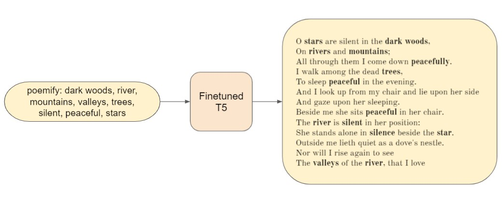

# topic2poem
End-to-End Poetry Generation from a list of topics using [T5: Text-To-Text Transfer Transformer](https://arxiv.org/abs/1910.10683)


<p align="middle">
  </img>
</p>

## Usage
All code is present in `code/main.ipynb` (opening this in [Google Colab](https://colab.research.google.com/) is preferable)

## Data

### Creating the Dataset
- Clone this repository
- Download the [Poetry Foundation](https://www.poetryfoundation.org/) dataset from [Kaggle](https://www.kaggle.com/johnhallman/complete-poetryfoundationorg-dataset) and place the downloaded `csv` file in `data/`
- `cd` to `data/` and run `bash pipeline.sh`   
  This will create [`data/final_dataset.csv`](data/final_dataset.csv)

### Details
- First, `data/clean_data.py` is executed, which removes/replaces some problematic characters and tokens
- After this, `data/filter_length.py` is executed, which keeps only the poems of length (in tokens) between `[50, 250]` and discards the rest
- Then, `data/filter_authors.py` is executed, which keeps only the poems written by a particular set of authors (specified in the file itself)
- After this, `data/add_topics.py` is executed which generates the list of topics for each poem using `data/extract_topics.py`  
The number of topics extracted for a given poem is sampled uniformly from `[7, 15]`

### Topic Extraction and Ranking
A 'topic' here refers to a unigram or a bigram which is present in the text  
The code for extracting and ranking is present in `data/extract_topics.py`

#### Extraction
- The given text is first labelled using [POS tagging](https://en.wikipedia.org/wiki/Part-of-speech_tagging), using [NLTK](https://www.nltk.org/api/nltk.tag.html#nltk.tag.perceptron.PerceptronTagger)
- Then, unigrams that are in `["JJ", "JJR", "JJS", "NN", "NNS", "NNP", "NNPS", "RB", "RBR", "RBS", "VBG"]` are classfied as topics
- For each noun (`["NN", "NNS", "NNP", "NNPS"]`) in the topics, if the previous token lies in `["JJ", "JJR", "JJS", "NN"]`, 
then the bigram formed after combining the two unigrams (i.e the previous token and the noun) is added to the topics, 
and the individual unigrams are removed from the topics (if they were seperately added before)  

[(List of NLTK POS tags)](https://stackoverflow.com/a/38264311)

#### Ranking
- Using [VADER](https://www.nltk.org/_modules/nltk/sentiment/vader.html), each topic's sentiment scores `(pos, neg, neu)` are obtained
- These are used to assign the topics a tuple of numbers, which is used for scoring and ranking them
  - For each topic, let `m = max(pos, neg, neu)` and let `(s1, s2) = sort([pos, neg])`
  - If `m` corresponds to `neu`, the topic is assigned a score of `(0, m, s1, s2)`
  - If `m` corresponds to `pos` or `neg`, then the topic is assigned a score of `(1, m, s2)`
- Topics are then sorted in decreasing order of the topic scores to get the final order

### Stopwords
`data/stopwords/stopwords.txt` is a combination of three different kinds of stopwords:
- [SMART stopwords list](http://www.ai.mit.edu/projects/jmlr/papers/volume5/lewis04a/a11-smart-stop-list/)
- [English Personal Names](https://www.matthewjockers.net/macroanalysisbook/expanded-stopwords-list/)
- A [few archaic stopwords](data/stopwords/custom.txt) which were added manually 

## Examples

```
Input: heroic wealth, cheerful godliness, selfish men, lowliest duties, naked heavens, stagnant waters, english dower

Output:
The God of love, who made thee
Of himself a little selfish men, created
In that first meeting of heaven and earth;
And now these fallen trees in England dower.
These trees which lack vitality have not grown long,
And stagnant waters bring us pain:
This land of immortality does suffer but decay;
The manhood gives rise to bear,
The angels complain,
"But still we must strive for higher things."
Everyone will agree,
One answer shall speak English dower;
What will the youth take or should be?
Or is it that all human need be;
Who are they therefore to bear
For such heroic wealth so scarcely,
Nor ever with patience keep pace with stagnant water;
They shall make naked heavens again,
Red Roofs and roofs from ceilings!
If they were not themselves, then they would die
```

```
Input: watered shoot, thickset fruit, singing bird, silver grapes, silver fleurs-de-lys, purple dyes, halcyon sea, 
vair, silk, rainbow, pomegranates, peacocks, paddles, nest, life

Output:
O sweet and low of the halcyon sea,
Golden grapes with purple dyes on each leaf;
And sweeter than all the other flowers!
Drip out the nest, open the doors,
Or split the shells in half-a-half.
The silver blossoms-de-lys
Each one for the little flower;
An angel's pear and blue blood:
A singing bird, an angel'll feed.
Chocolate spring and fall
On the golden apples on the leaves;
Silver blossoms are yellow in the autumn breezes;
The purple dyed orange seeds
```

```
Input: grief lay, wild sparkles, sepulchral urn, heavy heart, hair beneath, ashen greyness, solemnly, scorn

Output:
The hunter came down in yonder wood,
And the heavy heart was found beneath it;
But love and life and caroling were everywhere;
And love and hate and sin were everywhere.
Let there be beauty and commerce,
Lest it invade our earth?
Sepulchral urn is found near;
Lightly glides to the light;
Not solaceless ashen greyness, nor wild sparkles:
There shall the needful decay come before!
Lo, all must grieve lay beneath it.
Look! Wherefore I see no gravemorrow
The land of despair lay undefiled,
Fetter-fires that are not solemnly.
Men under such circumstances doth leave
Their own grief lay
```

```
Input: kindly, death, visible, tippet, swelling, shorter, setting, school, scarcely, roof, ring

Output:
The sun was blue, and the moon was white;
The stars were green, but not brown,
Not visible from the tippet,
Nor measles were curled up in blood,
But all seemed to be spitting away
And so much of an interest in school.
'Maybe it some day there
Someday I'll go back with that which I loved
(If Death had shown any interest)
Always shorter than his peers!
Yesternight this roof was seen,
perhaps because I couldn't see it shined out-
Or is shorter than the leaves too long ago:
By the bell was set low,
And therefore my love would look on me more,
Their name might have been cut short
```

```
Input: violent ways, tightened bow, peaceful, natural, misery, kind, fire, beauty

Output:
There is a peace in the night,
And of course, there is peace in nature.
When we are kind and fair,
We must be careful not with fire:
If in our country there is none misery
Therefore we can find peace in Nature's bush;
If by some peaceful means we shall be freed from violence
```

## References
- [Finetuning T5 for Summary Generation](https://github.com/abhimishra91/transformers-tutorials/blob/master/transformers_summarization_wandb.ipynb) 
- [T5 Finetuning Tips](https://discuss.huggingface.co/t/t5-finetuning-tips/684)
- [(Huggingface) T5 Docs](https://huggingface.co/transformers/model_doc/t5.html)
- [(Huggingface) Training T5](https://huggingface.co/transformers/model_doc/t5.html#training)
- [Finetuning T5 Tutorial](https://colab.research.google.com/github/patil-suraj/exploring-T5/blob/master/t5_fine_tuning.ipynb)
- [Few Shot Learning with T5](https://towardsdatascience.com/poor-mans-gpt-3-few-shot-text-generation-with-t5-transformer-51f1b01f843e)
- [Text Generation with Transformers](https://huggingface.co/blog/how-to-generate) 
